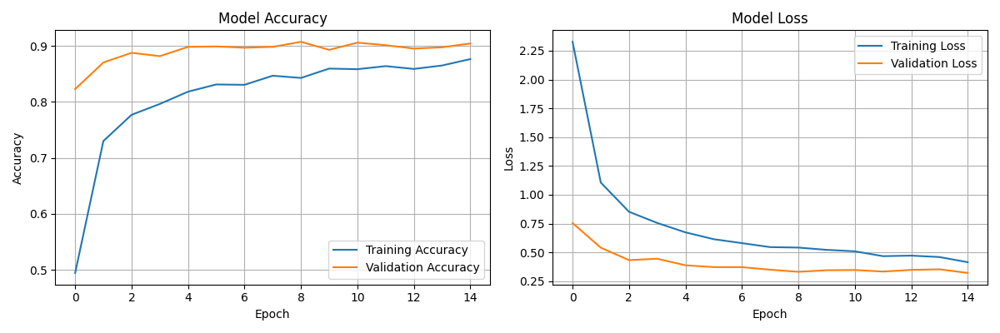

# AI-Powered Image Classification System

This repository contains an advanced deep learning pipeline for multi-class image recognition using transfer learning. It supports training on datasets like Caltech101 and provides an interactive Streamlit app for model demonstration.

---

## Table of Contents

- [Features](#features)
- [Requirements](#requirements)
- [Usage](#usage)
  - [Training (`train.py`)](#training-trainpy)
  - [Interactive Demo (`streamlit_app.py`)](#interactive-demo-streamlit_apppy)
- [Training Results](#training-results)
- [Notes](#notes)

---

## Features

- Transfer learning with MobileNetV2 (default), ResNet50, or EfficientNetB0.
- Data augmentation and robust training callbacks.
- Model checkpointing after every epoch.
- Fine-tuning support for improved accuracy.
- Interactive Streamlit app for visual inference and class probability visualization.

---

## Requirements

Install dependencies with:

```bash
pip install -r requirements.txt
```

---

## Usage

### Training (`train.py`)

This script handles all steps from dataset preparation to model training and evaluation.

**Key Features:**
- Automatically splits your dataset into train/validation/test if not already split.
- Uses transfer learning with a pre-trained CNN (default: MobileNetV2 for smaller model size).
- Trains the classification head first, then fine-tunes the base model.
- Saves the best model and all epoch checkpoints.
- Evaluates the model and prints a classification report and confusion matrix.

**How to run:**

```bash
python train.py
```

**What happens:**
1. The script checks for a `dataset/` directory with subfolders for each class.
2. If not already split, it creates `split_dataset/train`, `split_dataset/validation`, and `split_dataset/test`.
3. Trains the model for 15 epochs (default) with only the head trainable.
4. Fine-tunes the model for 5 more epochs with some base layers unfrozen.
5. Saves the best model as `best_model.keras` and the final model as `advanced_image_classifier.keras`.
6. Prints evaluation metrics and shows training curves.

---

### Interactive Demo (`streamlit_app.py`)

A beautiful, interactive Streamlit app to showcase the trained model.

**Key Features:**
- Lets you browse sample images by class.
- Shows the model's prediction and confidence for each image.
- Displays a bar chart of the top class probabilities.
- Quick gallery for browsing multiple images.

**How to run:**

```bash
streamlit run streamlit_app.py
```

**What happens:**
- Loads the trained model (`best_model.keras` by default).
- Lets you select a class and image from the sidebar.
- Shows the selected image, predicted class, confidence, and a probability bar chart.
- Includes a gallery of sample images for quick browsing.

---

## Training Results

### Training and Validation Loss



### Training Logs

<details>
<summary>Click to expand logs.txt</summary>

```
Using device: mps
Detected 102 classes: ['BACKGROUND_Google', 'Faces', 'Faces_easy', 'Leopards', 'Motorbikes', 'accordion', 'airplanes', 'anchor', 'ant', 'barrel', 'bass', 'beaver', 'binocular', 'bonsai', 'brain', 'brontosaurus', 'buddha', 'butterfly', 'camera', 'cannon', 'car_side', 'ceiling_fan', 'cellphone', 'chair', 'chandelier', 'cougar_body', 'cougar_face', 'crab', 'crayfish', 'crocodile', 'crocodile_head', 'cup', 'dalmatian', 'dollar_bill', 'dolphin', 'dragonfly', 'electric_guitar', 'elephant', 'emu', 'euphonium', 'ewer', 'ferry', 'flamingo', 'flamingo_head', 'garfield', 'gerenuk', 'gramophone', 'grand_piano', 'hawksbill', 'headphone', 'hedgehog', 'helicopter', 'ibis', 'inline_skate', 'joshua_tree', 'kangaroo', 'ketch', 'lamp', 'laptop', 'llama', 'lobster', 'lotus', 'mandolin', 'mayfly', 'menorah', 'metronome', 'minaret', 'nautilus', 'octopus', 'okapi', 'pagoda', 'panda', 'pigeon', 'pizza', 'platypus', 'pyramid', 'revolver', 'rhino', 'rooster', 'saxophone', 'schooner', 'scissors', 'scorpion', 'sea_horse', 'snoopy', 'soccer_ball', 'stapler', 'starfish', 'stegosaurus', 'stop_sign', 'strawberry', 'sunflower', 'tick', 'trilobite', 'umbrella', 'watch', 'water_lilly', 'wheelchair', 'wild_cat', 'windsor_chair', 'wrench', 'yin_yang']
AdvancedImageClassifierTorch(
  (base): MobileNetV2(
    (features): Sequential(
      (0): Conv2dNormActivation(
        (0): Conv2d(3, 32, kernel_size=(3, 3), stride=(2, 2), padding=(1, 1), bias=False)
        (1): BatchNorm2d(32, eps=1e-05, momentum=0.1, affine=True, track_running_stats=True)
        (2): ReLU6(inplace=True)
      )
      (1): InvertedResidual(
        (conv): Sequential(
          (0): Conv2dNormActivation(
            (0): Conv2d(32, 32, kernel_size=(3, 3), stride=(1, 1), padding=(1, 1), groups=32, bias=False)
            (1): BatchNorm2d(32, eps=1e-05, momentum=0.1, affine=True, track_running_stats=True)
            (2): ReLU6(inplace=True)
          )
          (1): Conv2d(32, 16, kernel_size=(1, 1), stride=(1, 1), bias=False)
          (2): BatchNorm2d(16, eps=1e-05, momentum=0.1, affine=True, track_running_stats=True)
        )
      )
      (2): InvertedResidual(
        (conv): Sequential(
          (0): Conv2dNormActivation(
            (0): Conv2d(16, 96, kernel_size=(1, 1), stride=(1, 1), bias=False)
            (1): BatchNorm2d(96, eps=1e-05, momentum=0.1, affine=True, track_running_stats=True)
            (2): ReLU6(inplace=True)
          )
          (1): Conv2dNormActivation(
            (0): Conv2d(96, 96, kernel_size=(3, 3), stride=(2, 2), padding=(1, 1), groups=96, bias=False)
            (1): BatchNorm2d(96, eps=1e-05, momentum=0.1, affine=True, track_running_stats=True)
            (2): ReLU6(inplace=True)
          )
          (2): Conv2d(96, 24, kernel_size=(1, 1), stride=(1, 1), bias=False)
          (3): BatchNorm2d(24, eps=1e-05, momentum=0.1, affine=True, track_running_stats=True)
        )
      )
      (3): InvertedResidual(
        (conv): Sequential(
          (0): Conv2dNormActivation(
            (0): Conv2d(24, 144, kernel_size=(1, 1), stride=(1, 1), bias=False)
            (1): BatchNorm2d(144, eps=1e-05, momentum=0.1, affine=True, track_running_stats=True)
            (2): ReLU6(inplace=True)
          )
          (1): Conv2dNormActivation(
            (0): Conv2d(144, 144, kernel_size=(3, 3), stride=(1, 1), padding=(1, 1), groups=144, bias=False)
            (1): BatchNorm2d(144, eps=1e-05, momentum=0.1, affine=True, track_running_stats=True)
            (2): ReLU6(inplace=True)
          )
          (2): Conv2d(144, 24, kernel_size=(1, 1), stride=(1, 1), bias=False)
          (3): BatchNorm2d(24, eps=1e-05, momentum=0.1, affine=True, track_running_stats=True)
        )
      )
      (4): InvertedResidual(
        (conv): Sequential(
          (0): Conv2dNormActivation(
            (0): Conv2d(24, 144, kernel_size=(1, 1), stride=(1, 1), bias=False)
            (1): BatchNorm2d(144, eps=1e-05, momentum=0.1, affine=True, track_running_stats=True)
            (2): ReLU6(inplace=True)
          )
          (1): Conv2dNormActivation(
            (0): Conv2d(144, 144, kernel_size=(3, 3), stride=(2, 2), padding=(1, 1), groups=144, bias=False)
            (1): BatchNorm2d(144, eps=1e-05, momentum=0.1, affine=True, track_running_stats=True)
            (2): ReLU6(inplace=True)
          )
          (2): Conv2d(144, 32, kernel_size=(1, 1), stride=(1, 1), bias=False)
          (3): BatchNorm2d(32, eps=1e-05, momentum=0.1, affine=True, track_running_stats=True)
        )
      )
      (5): InvertedResidual(
        (conv): Sequential(
          (0): Conv2dNormActivation(
            (0): Conv2d(32, 192, kernel_size=(1, 1), stride=(1, 1), bias=False)
            (1): BatchNorm2d(192, eps=1e-05, momentum=0.1, affine=True, track_running_stats=True)
            (2): ReLU6(inplace=True)
          )
          (1): Conv2dNormActivation(
            (0): Conv2d(192, 192, kernel_size=(3, 3), stride=(1, 1), padding=(1, 1), groups=192, bias=False)
            (1): BatchNorm2d(192, eps=1e-05, momentum=0.1, affine=True, track_running_stats=True)
            (2): ReLU6(inplace=True)
          )
          (2): Conv2d(192, 32, kernel_size=(1, 1), stride=(1, 1), bias=False)
          (3): BatchNorm2d(32, eps=1e-05, momentum=0.1, affine=True, track_running_stats=True)
        )
      )
      (6): InvertedResidual(
        (conv): Sequential(
          (0): Conv2dNormActivation(
            (0): Conv2d(32, 192, kernel_size=(1, 1), stride=(1, 1), bias=False)
            (1): BatchNorm2d(192, eps=1e-05, momentum=0.1, affine=True, track_running_stats=True)
            (2): ReLU6(inplace=True)
          )
          (1): Conv2dNormActivation(
            (0): Conv2d(192, 192, kernel_size=(3, 3), stride=(1, 1), padding=(1, 1), groups=192, bias=False)
            (1): BatchNorm2d(192, eps=1e-05, momentum=0.1, affine=True, track_running_stats=True)
            (2): ReLU6(inplace=True)
          )
          (2): Conv2d(192, 32, kernel_size=(1, 1), stride=(1, 1), bias=False)
          (3): BatchNorm2d(32, eps=1e-05, momentum=0.1, affine=True, track_running_stats=True)
        )
      )
      (7): InvertedResidual(
        (conv): Sequential(
          (0): Conv2dNormActivation(
            (0): Conv2d(32, 192, kernel_size=(1, 1), stride=(1, 1), bias=False)
            (1): BatchNorm2d(192, eps=1e-05, momentum=0.1, affine=True, track_running_stats=True)
            (2): ReLU6(inplace=True)
          )
          (1): Conv2dNormActivation(
            (0): Conv2d(192, 192, kernel_size=(3, 3), stride=(2, 2), padding=(1, 1), groups=192, bias=False)
            (1): BatchNorm2d(192, eps=1e-05, momentum=0.1, affine=True, track_running_stats=True)
            (2): ReLU6(inplace=True)
          )
          (2): Conv2d(192, 64, kernel_size=(1, 1), stride=(1, 1), bias=False)
          (3): BatchNorm2d(64, eps=1e-05, momentum=0.1, affine=True, track_running_stats=True)
        )
      )
      (8): InvertedResidual(
        (conv): Sequential(
          (0): Conv2dNormActivation(
            (0): Conv2d(64, 384, kernel_size=(1, 1), stride=(1, 1), bias=False)
            (1): BatchNorm2d(384, eps=1e-05, momentum=0.1, affine=True, track_running_stats=True)
            (2): ReLU6(inplace=True)
          )
          (1): Conv2dNormActivation(
            (0): Conv2d(384, 384, kernel_size=(3, 3), stride=(1, 1), padding=(1, 1), groups=384, bias=False)
            (1): BatchNorm2d(384, eps=1e-05, momentum=0.1, affine=True, track_running_stats=True)
            (2): ReLU6(inplace=True)
          )
          (2): Conv2d(384, 64, kernel_size=(1, 1), stride=(1, 1), bias=False)
          (3): BatchNorm2d(64, eps=1e-05, momentum=0.1, affine=True, track_running_stats=True)
        )
      )
      (9): InvertedResidual(
        (conv): Sequential(
          (0): Conv2dNormActivation(
            (0): Conv2d(64, 384, kernel_size=(1, 1), stride=(1, 1), bias=False)
            (1): BatchNorm2d(384, eps=1e-05, momentum=0.1, affine=True, track_running_stats=True)
            (2): ReLU6(inplace=True)
          )
          (1): Conv2dNormActivation(
            (0): Conv2d(384, 384, kernel_size=(3, 3), stride=(1, 1), padding=(1, 1), groups=384, bias=False)
            (1): BatchNorm2d(384, eps=1e-05, momentum=0.1, affine=True, track_running_stats=True)
            (2): ReLU6(inplace=True)
          )
          (2): Conv2d(384, 64, kernel_size=(1, 1), stride=(1, 1), bias=False)
          (3): BatchNorm2d(64, eps=1e-05, momentum=0.1, affine=True, track_running_stats=True)
        )
      )
      (10): InvertedResidual(
        (conv): Sequential(
          (0): Conv2dNormActivation(
            (0): Conv2d(64, 384, kernel_size=(1, 1), stride=(1, 1), bias=False)
            (1): BatchNorm2d(384, eps=1e-05, momentum=0.1, affine=True, track_running_stats=True)
            (2): ReLU6(inplace=True)
          )
          (1): Conv2dNormActivation(
            (0): Conv2d(384, 384, kernel_size=(3, 3), stride=(1, 1), padding=(1, 1), groups=384, bias=False)
            (1): BatchNorm2d(384, eps=1e-05, momentum=0.1, affine=True, track_running_stats=True)
            (2): ReLU6(inplace=True)
          )
          (2): Conv2d(384, 64, kernel_size=(1, 1), stride=(1, 1), bias=False)
          (3): BatchNorm2d(64, eps=1e-05, momentum=0.1, affine=True, track_running_stats=True)
        )
      )
      (11): InvertedResidual(
        (conv): Sequential(
          (0): Conv2dNormActivation(
            (0): Conv2d(64, 384, kernel_size=(1, 1), stride=(1, 1), bias=False)
            (1): BatchNorm2d(384, eps=1e-05, momentum=0.1, affine=True, track_running_stats=True)
            (2): ReLU6(inplace=True)
          )
          (1): Conv2dNormActivation(
            (0): Conv2d(384, 384, kernel_size=(3, 3), stride=(1, 1), padding=(1, 1), groups=384, bias=False)
            (1): BatchNorm2d(384, eps=1e-05, momentum=0.1, affine=True, track_running_stats=True)
            (2): ReLU6(inplace=True)
          )
          (2): Conv2d(384, 96, kernel_size=(1, 1), stride=(1, 1), bias=False)
          (3): BatchNorm2d(96, eps=1e-05, momentum=0.1, affine=True, track_running_stats=True)
        )
      )
      (12): InvertedResidual(
        (conv): Sequential(
          (0): Conv2dNormActivation(
            (0): Conv2d(96, 576, kernel_size=(1, 1), stride=(1, 1), bias=False)
            (1): BatchNorm2d(576, eps=1e-05, momentum=0.1, affine=True, track_running_stats=True)
            (2): ReLU6(inplace=True)
          )
          (1): Conv2dNormActivation(
            (0): Conv2d(576, 576, kernel_size=(3, 3), stride=(1, 1), padding=(1, 1), groups=576, bias=False)
            (1): BatchNorm2d(576, eps=1e-05, momentum=0.1, affine=True, track_running_stats=True)
            (2): ReLU6(inplace=True)
          )
          (2): Conv2d(576, 96, kernel_size=(1, 1), stride=(1, 1), bias=False)
          (3): BatchNorm2d(96, eps=1e-05, momentum=0.1, affine=True, track_running_stats=True)
        )
      )
      (13): InvertedResidual(
        (conv): Sequential(
          (0): Conv2dNormActivation(
            (0): Conv2d(96, 576, kernel_size=(1, 1), stride=(1, 1), bias=False)
            (1): BatchNorm2d(576, eps=1e-05, momentum=0.1, affine=True, track_running_stats=True)
            (2): ReLU6(inplace=True)
          )
          (1): Conv2dNormActivation(
            (0): Conv2d(576, 576, kernel_size=(3, 3), stride=(1, 1), padding=(1, 1), groups=576, bias=False)
            (1): BatchNorm2d(576, eps=1e-05, momentum=0.1, affine=True, track_running_stats=True)
            (2): ReLU6(inplace=True)
          )
          (2): Conv2d(576, 96, kernel_size=(1, 1), stride=(1, 1), bias=False)
          (3): BatchNorm2d(96, eps=1e-05, momentum=0.1, affine=True, track_running_stats=True)
        )
      )
      (14): InvertedResidual(
        (conv): Sequential(
          (0): Conv2dNormActivation(
            (0): Conv2d(96, 576, kernel_size=(1, 1), stride=(1, 1), bias=False)
            (1): BatchNorm2d(576, eps=1e-05, momentum=0.1, affine=True, track_running_stats=True)
            (2): ReLU6(inplace=True)
          )
          (1): Conv2dNormActivation(
            (0): Conv2d(576, 576, kernel_size=(3, 3), stride=(2, 2), padding=(1, 1), groups=576, bias=False)
            (1): BatchNorm2d(576, eps=1e-05, momentum=0.1, affine=True, track_running_stats=True)
            (2): ReLU6(inplace=True)
          )
          (2): Conv2d(576, 160, kernel_size=(1, 1), stride=(1, 1), bias=False)
          (3): BatchNorm2d(160, eps=1e-05, momentum=0.1, affine=True, track_running_stats=True)
        )
      )
      (15): InvertedResidual(
        (conv): Sequential(
          (0): Conv2dNormActivation(
            (0): Conv2d(160, 960, kernel_size=(1, 1), stride=(1, 1), bias=False)
            (1): BatchNorm2d(960, eps=1e-05, momentum=0.1, affine=True, track_running_stats=True)
            (2): ReLU6(inplace=True)
          )
          (1): Conv2dNormActivation(
            (0): Conv2d(960, 960, kernel_size=(3, 3), stride=(1, 1), padding=(1, 1), groups=960, bias=False)
            (1): BatchNorm2d(960, eps=1e-05, momentum=0.1, affine=True, track_running_stats=True)
            (2): ReLU6(inplace=True)
          )
          (2): Conv2d(960, 160, kernel_size=(1, 1), stride=(1, 1), bias=False)
          (3): BatchNorm2d(160, eps=1e-05, momentum=0.1, affine=True, track_running_stats=True)
        )
      )
      (16): InvertedResidual(
        (conv): Sequential(
          (0): Conv2dNormActivation(
            (0): Conv2d(160, 960, kernel_size=(1, 1), stride=(1, 1), bias=False)
            (1): BatchNorm2d(960, eps=1e-05, momentum=0.1, affine=True, track_running_stats=True)
            (2): ReLU6(inplace=True)
          )
          (1): Conv2dNormActivation(
            (0): Conv2d(960, 960, kernel_size=(3, 3), stride=(1, 1), padding=(1, 1), groups=960, bias=False)
            (1): BatchNorm2d(960, eps=1e-05, momentum=0.1, affine=True, track_running_stats=True)
            (2): ReLU6(inplace=True)
          )
          (2): Conv2d(960, 160, kernel_size=(1, 1), stride=(1, 1), bias=False)
          (3): BatchNorm2d(160, eps=1e-05, momentum=0.1, affine=True, track_running_stats=True)
        )
      )
      (17): InvertedResidual(
        (conv): Sequential(
          (0): Conv2dNormActivation(
            (0): Conv2d(160, 960, kernel_size=(1, 1), stride=(1, 1), bias=False)
            (1): BatchNorm2d(960, eps=1e-05, momentum=0.1, affine=True, track_running_stats=True)
            (2): ReLU6(inplace=True)
          )
          (1): Conv2dNormActivation(
            (0): Conv2d(960, 960, kernel_size=(3, 3), stride=(1, 1), padding=(1, 1), groups=960, bias=False)
            (1): BatchNorm2d(960, eps=1e-05, momentum=0.1, affine=True, track_running_stats=True)
            (2): ReLU6(inplace=True)
          )
          (2): Conv2d(960, 320, kernel_size=(1, 1), stride=(1, 1), bias=False)
          (3): BatchNorm2d(320, eps=1e-05, momentum=0.1, affine=True, track_running_stats=True)
        )
      )
      (18): Conv2dNormActivation(
        (0): Conv2d(320, 1280, kernel_size=(1, 1), stride=(1, 1), bias=False)
        (1): BatchNorm2d(1280, eps=1e-05, momentum=0.1, affine=True, track_running_stats=True)
        (2): ReLU6(inplace=True)
      )
    )
    (classifier): Identity()
  )
  (classifier): Sequential(
    (0): Dropout(p=0.3, inplace=False)
    (1): Linear(in_features=1280, out_features=512, bias=True)
    (2): ReLU()
    (3): BatchNorm1d(512, eps=1e-05, momentum=0.1, affine=True, track_running_stats=True)
    (4): Dropout(p=0.5, inplace=False)
    (5): Linear(in_features=512, out_features=256, bias=True)
    (6): ReLU()
    (7): BatchNorm1d(256, eps=1e-05, momentum=0.1, affine=True, track_running_stats=True)
    (8): Dropout(p=0.3, inplace=False)
    (9): Linear(in_features=256, out_features=102, bias=True)
  )
)
Epoch 1 Training:   0%|                                                                                                                 | 0/100 [00:00<?, ?it/s]Using device: mps
Using device: mps
Epoch 1 Validation:   0%|                                                                                                                | 0/21 [00:00<?, ?it/s]Using device: mps
Using device: mps
Epoch 1/10 - Train Loss: 2.8959, Acc: 0.3778 | Val Loss: 1.8996, Acc: 0.5256                                                                                    
Saved best model to best_model.pt
Epoch 2 Training:   0%|                                                                                                                 | 0/100 [00:00<?, ?it/s]Using device: mps
Using device: mps
Epoch 2 Validation:   0%|                                                                                                                | 0/21 [00:00<?, ?it/s]Using device: mps
Using device: mps
Epoch 2/10 - Train Loss: 1.7790, Acc: 0.5617 | Val Loss: 1.3430, Acc: 0.6440                                                                                    
Saved best model to best_model.pt
Epoch 3 Training:   0%|                                                                                                                 | 0/100 [00:00<?, ?it/s]Using device: mps
Using device: mps
Epoch 3 Validation:   0%|                                                                                                                | 0/21 [00:00<?, ?it/s]Using device: mps
Using device: mps
Epoch 3/10 - Train Loss: 1.3464, Acc: 0.6489 | Val Loss: 0.9991, Acc: 0.7262                                                                                    
Saved best model to best_model.pt
Epoch 4 Training:   0%|                                                                                                                 | 0/100 [00:00<?, ?it/s]Using device: mps
Using device: mps
Epoch 4 Validation:   0%|                                                                                                                | 0/21 [00:00<?, ?it/s]Using device: mps
Using device: mps
Epoch 4/10 - Train Loss: 1.0212, Acc: 0.7207 | Val Loss: 0.9400, Acc: 0.7534                                                                                    
Saved best model to best_model.pt
Epoch 5 Training:   0%|                                                                                                                 | 0/100 [00:00<?, ?it/s]Using device: mps
Using device: mps
Epoch 5 Validation:   0%|                                                                                                                | 0/21 [00:00<?, ?it/s]Using device: mps
Using device: mps
Epoch 5/10 - Train Loss: 0.8888, Acc: 0.7544 | Val Loss: 0.8151, Acc: 0.7753                                                                                    
Saved best model to best_model.pt
Epoch 6 Training:   0%|                                                                                                                 | 0/100 [00:00<?, ?it/s]Using device: mps
Using device: mps
Epoch 6 Validation:   0%|                                                                                                                | 0/21 [00:00<?, ?it/s]Using device: mps
Using device: mps
Epoch 6/10 - Train Loss: 0.7613, Acc: 0.7848 | Val Loss: 1.1601, Acc: 0.7036                                                                                    
Epoch 7 Training:   0%|                                                                                                                 | 0/100 [00:00<?, ?it/s]Using device: mps
Using device: mps
Epoch 7 Validation:   0%|                                                                                                                | 0/21 [00:00<?, ?it/s]Using device: mps
Using device: mps
Epoch 7/10 - Train Loss: 0.7654, Acc: 0.7787 | Val Loss: 0.6915, Acc: 0.8145                                                                                    
Saved best model to best_model.pt
Epoch 8 Training:   0%|                                                                                                                 | 0/100 [00:00<?, ?it/s]Using device: mps
Using device: mps
Epoch 8 Validation:   0%|                                                                                                                         | 0/21 [00:00<?, ?it/s]Using device: mps
Using device: mps
Epoch 8/10 - Train Loss: 0.6180, Acc: 0.8237 | Val Loss: 0.6870, Acc: 0.8167                                                                                             
Saved best model to best_model.pt
Epoch 9 Training:   0%|                                                                                                                          | 0/100 [00:00<?, ?it/s]Using device: mps
Using device: mps
Epoch 9 Validation:   0%|                                                                                                                         | 0/21 [00:00<?, ?it/s]Using device: mps
Using device: mps
Epoch 9/10 - Train Loss: 0.5442, Acc: 0.8404 | Val Loss: 0.6966, Acc: 0.8303                                                                                             
Saved best model to best_model.pt
Epoch 10 Training:   0%|                                                                                                                         | 0/100 [00:00<?, ?it/s]Using device: mps
Using device: mps
Epoch 10 Validation:   0%|                                                                                                                        | 0/21 [00:00<?, ?it/s]Using device: mps
Using device: mps
Epoch 10/10 - Train Loss: 0.4962, Acc: 0.8522 | Val Loss: 0.6021, Acc: 0.8348                                                                                            
Saved best model to best_model.pt
Epoch 1 Training:   0%|                                                                                                                          | 0/100 [00:00<?, ?it/s]Python(28297) MallocStackLogging: can't turn off malloc stack logging because it was not enabled.
Using device: mps
Python(28303) MallocStackLogging: can't turn off malloc stack logging because it was not enabled.
Using device: mps
Epoch 1 Validation:   0%|                                                                                                                         | 0/21 [00:00<?, ?it/s]Python(28520) MallocStackLogging: can't turn off malloc stack logging because it was not enabled.
Python(28540) MallocStackLogging: can't turn off malloc stack logging because it was not enabled.
Using device: mps
Using device: mps
Epoch 1/5 - Train Loss: 0.2937, Acc: 0.9148 | Val Loss: 0.4251, Acc: 0.8778                                                                                              
Saved best model to best_finetuned_model.pt
Epoch 2 Training:   0%|                                                                                                                          | 0/100 [00:00<?, ?it/s]Python(28860) MallocStackLogging: can't turn off malloc stack logging because it was not enabled.
Using device: mps
Python(28868) MallocStackLogging: can't turn off malloc stack logging because it was not enabled.
Using device: mps
Epoch 2 Validation:   0%|                                                                                                                         | 0/21 [00:00<?, ?it/s]Python(29761) MallocStackLogging: can't turn off malloc stack logging because it was not enabled.
Python(29762) MallocStackLogging: can't turn off malloc stack logging because it was not enabled.
Using device: mps
Using device: mps
Epoch 2/5 - Train Loss: 0.2060, Acc: 0.9403 | Val Loss: 0.4110, Acc: 0.8929                                                                                              
Saved best model to best_finetuned_model.pt
Epoch 3 Training:   0%|                                                                                                                          | 0/100 [00:00<?, ?it/s]Python(29787) MallocStackLogging: can't turn off malloc stack logging because it was not enabled.
Using device: mps
Python(29794) MallocStackLogging: can't turn off malloc stack logging because it was not enabled.
Using device: mps
Epoch 3 Validation:   0%|                                                                                                                         | 0/21 [00:00<?, ?it/s]Python(30372) MallocStackLogging: can't turn off malloc stack logging because it was not enabled.
Python(30373) MallocStackLogging: can't turn off malloc stack logging because it was not enabled.
Using device: mps
Using device: mps
Epoch 3/5 - Train Loss: 0.1718, Acc: 0.9521 | Val Loss: 0.3973, Acc: 0.8937                                                                                              
Saved best model to best_finetuned_model.pt
Epoch 4 Training:   0%|                                                                                                                          | 0/100 [00:00<?, ?it/s]Python(30397) MallocStackLogging: can't turn off malloc stack logging because it was not enabled.
Using device: mps
Python(30780) MallocStackLogging: can't turn off malloc stack logging because it was not enabled.
Using device: mps
Epoch 4 Validation:   0%|                                                                                                                         | 0/21 [00:00<?, ?it/s]Python(31030) MallocStackLogging: can't turn off malloc stack logging because it was not enabled.
Python(31031) MallocStackLogging: can't turn off malloc stack logging because it was not enabled.
Using device: mps
Using device: mps
Epoch 4/5 - Train Loss: 0.1502, Acc: 0.9595 | Val Loss: 0.3914, Acc: 0.8952                                                                                              
Saved best model to best_finetuned_model.pt
Epoch 5 Training:   0%|                                                                                                                          | 0/100 [00:00<?, ?it/s]Python(31428) MallocStackLogging: can't turn off malloc stack logging because it was not enabled.
Using device: mps
Python(31435) MallocStackLogging: can't turn off malloc stack logging because it was not enabled.
Using device: mps
Epoch 5 Validation:   0%|                                                                                                                         | 0/21 [00:00<?, ?it/s]Python(31909) MallocStackLogging: can't turn off malloc stack logging because it was not enabled.
Python(31914) MallocStackLogging: can't turn off malloc stack logging because it was not enabled.
Using device: mps
Using device: mps
Epoch 5/5 - Train Loss: 0.1351, Acc: 0.9654 | Val Loss: 0.3941, Acc: 0.8929                                                                                              
Python(31928) MallocStackLogging: can't turn off malloc stack logging because it was not enabled.
Python(31929) MallocStackLogging: can't turn off malloc stack logging because it was not enabled.
Using device: mps
Using device: mps
Classification Report:
                   precision    recall  f1-score   support

BACKGROUND_Google       0.80      0.75      0.77        71
            Faces       0.98      0.98      0.98        66
       Faces_easy       0.98      0.98      0.98        66
         Leopards       1.00      1.00      1.00        30
       Motorbikes       0.98      1.00      0.99       121
        accordion       1.00      1.00      1.00         9
        airplanes       0.98      1.00      0.99       120
           anchor       0.44      0.57      0.50         7
              ant       0.83      0.71      0.77         7
           barrel       1.00      1.00      1.00         8
             bass       0.54      0.78      0.64         9
           beaver       0.62      0.62      0.62         8
        binocular       1.00      1.00      1.00         6
           bonsai       1.00      0.90      0.95        20
            brain       1.00      0.81      0.90        16
     brontosaurus       1.00      0.57      0.73         7
           buddha       0.93      1.00      0.97        14
        butterfly       1.00      1.00      1.00        15
           camera       0.88      0.88      0.88         8
           cannon       0.40      0.29      0.33         7
         car_side       1.00      1.00      1.00        19
      ceiling_fan       1.00      1.00      1.00         8
        cellphone       0.90      0.90      0.90        10
            chair       0.80      0.80      0.80        10
       chandelier       0.94      0.88      0.91        17
      cougar_body       0.50      0.50      0.50         8
      cougar_face       0.73      0.73      0.73        11
             crab       0.88      0.58      0.70        12
         crayfish       0.69      1.00      0.81        11
        crocodile       1.00      0.50      0.67         8
   crocodile_head       0.73      0.89      0.80         9
              cup       0.82      0.90      0.86        10
        dalmatian       0.92      1.00      0.96        11
      dollar_bill       1.00      1.00      1.00         9
          dolphin       0.90      0.82      0.86        11
        dragonfly       0.85      1.00      0.92        11
  electric_guitar       0.78      0.58      0.67        12
         elephant       1.00      0.55      0.71        11
              emu       0.88      0.78      0.82         9
        euphonium       1.00      1.00      1.00        11
             ewer       1.00      0.86      0.92        14
            ferry       1.00      0.91      0.95        11
         flamingo       0.82      0.82      0.82        11
    flamingo_head       0.89      1.00      0.94         8
         garfield       1.00      1.00      1.00         6
          gerenuk       1.00      0.83      0.91         6
       gramophone       1.00      1.00      1.00         9
      grand_piano       1.00      1.00      1.00        16
        hawksbill       1.00      1.00      1.00        15
        headphone       0.86      0.86      0.86         7
         hedgehog       0.90      1.00      0.95         9
       helicopter       0.93      1.00      0.97        14
             ibis       0.92      1.00      0.96        12
     inline_skate       1.00      1.00      1.00         6
      joshua_tree       1.00      0.91      0.95        11
         kangaroo       0.81      0.93      0.87        14
            ketch       0.80      0.89      0.84        18
             lamp       0.71      1.00      0.83        10
           laptop       0.86      0.92      0.89        13
            llama       0.71      0.77      0.74        13
          lobster       0.71      0.71      0.71         7
            lotus       0.50      0.45      0.48        11
         mandolin       0.60      0.86      0.71         7
           mayfly       1.00      0.33      0.50         6
          menorah       0.88      1.00      0.93        14
        metronome       1.00      1.00      1.00         6
          minaret       1.00      0.83      0.91        12
         nautilus       0.80      0.89      0.84         9
          octopus       0.57      0.67      0.62         6
            okapi       0.75      0.86      0.80         7
           pagoda       1.00      1.00      1.00         8
            panda       1.00      1.00      1.00         7
           pigeon       1.00      1.00      1.00         8
            pizza       1.00      1.00      1.00         9
         platypus       0.50      0.17      0.25         6
          pyramid       0.90      0.90      0.90        10
         revolver       0.93      1.00      0.96        13
            rhino       0.77      1.00      0.87        10
          rooster       1.00      1.00      1.00         8
        saxophone       1.00      0.83      0.91         6
         schooner       0.80      0.80      0.80        10
         scissors       1.00      1.00      1.00         7
         scorpion       0.71      0.71      0.71        14
        sea_horse       0.90      0.90      0.90        10
           snoopy       1.00      0.83      0.91         6
      soccer_ball       1.00      1.00      1.00        11
          stapler       0.58      0.88      0.70         8
         starfish       1.00      0.79      0.88        14
      stegosaurus       1.00      1.00      1.00        10
        stop_sign       0.92      1.00      0.96        11
       strawberry       0.86      1.00      0.92         6
        sunflower       1.00      1.00      1.00        14
             tick       1.00      1.00      1.00         8
        trilobite       1.00      1.00      1.00        14
         umbrella       1.00      0.83      0.91        12
            watch       0.97      1.00      0.99        37
      water_lilly       0.25      0.29      0.27         7
       wheelchair       0.90      0.90      0.90        10
         wild_cat       0.43      0.50      0.46         6
    windsor_chair       0.89      0.89      0.89         9
           wrench       0.78      1.00      0.88         7
         yin_yang       1.00      0.89      0.94         9

         accuracy                           0.90      1466
        macro avg       0.87      0.86      0.86      1466
     weighted avg       0.91      0.90      0.90      1466

```
</details>

---

## Notes

- The default model is MobileNetV2 for fast training and small file size (suitable for GitHub).
- You can switch to ResNet50 or EfficientNetB0 by changing the `base_model_name` argument in `train.py`.
- For best results, use a well-organized dataset with one subfolder per class under `dataset/`.

---

**Enjoy exploring and deploying your own image classifier!**
